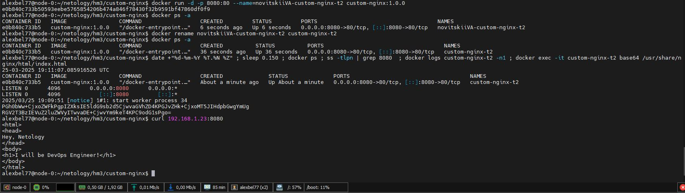
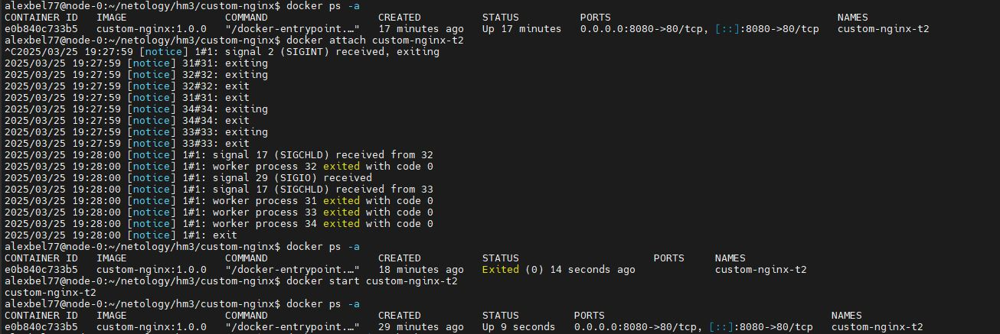
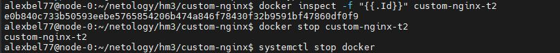
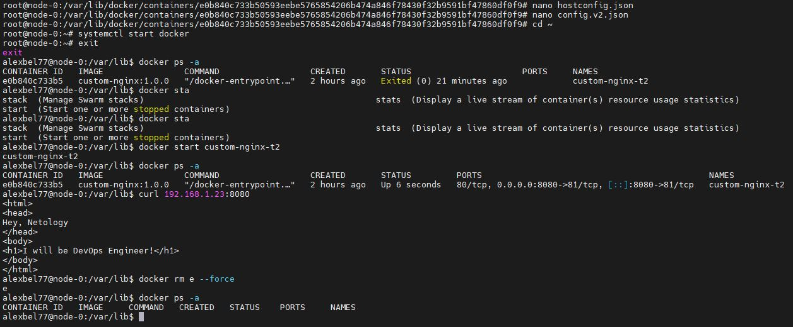
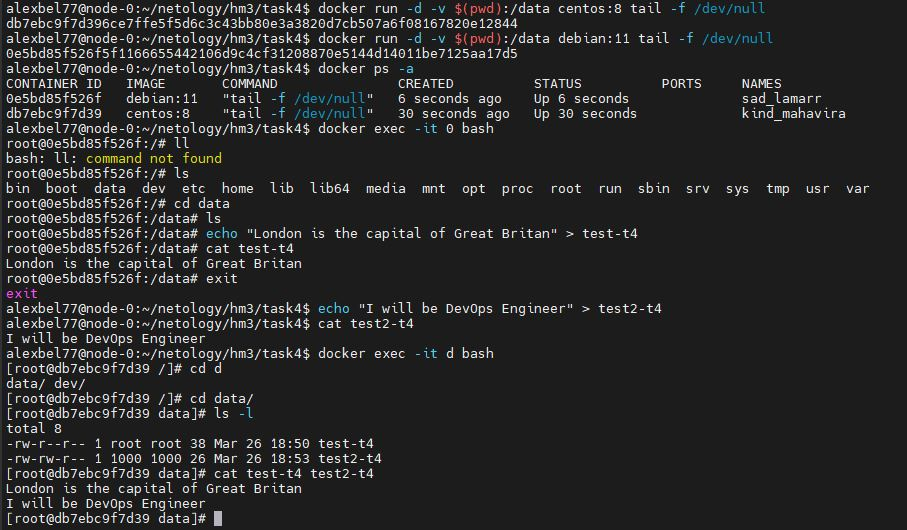
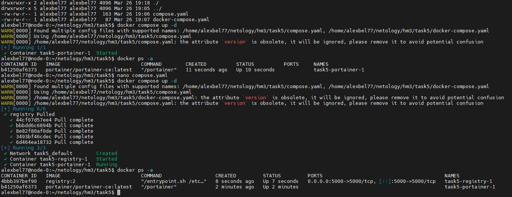
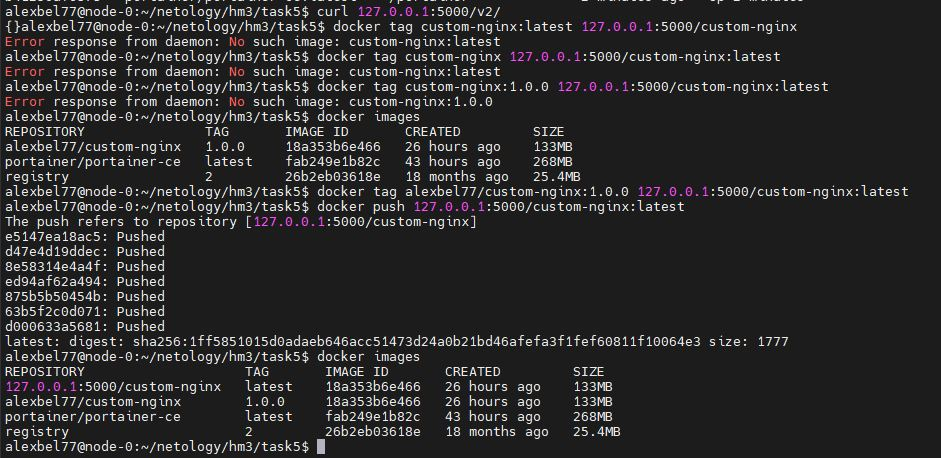
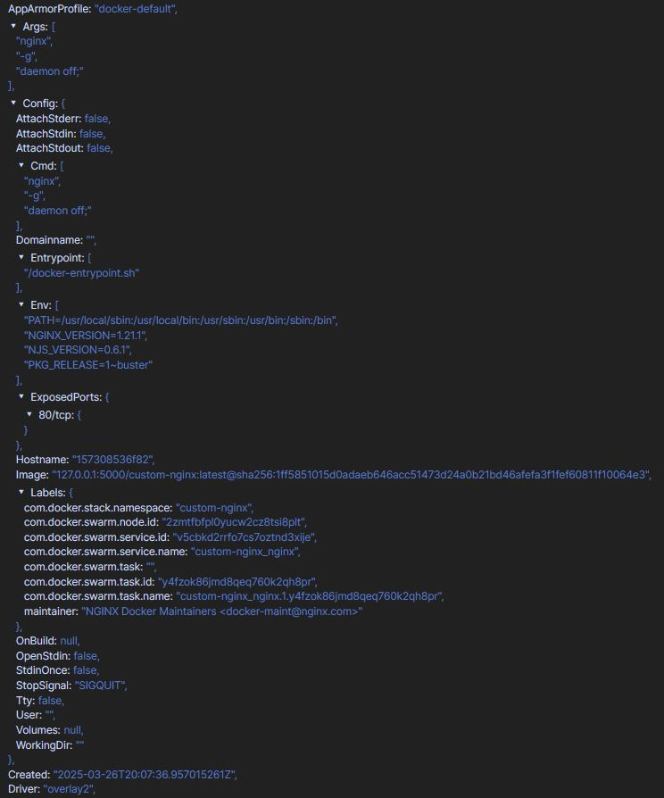
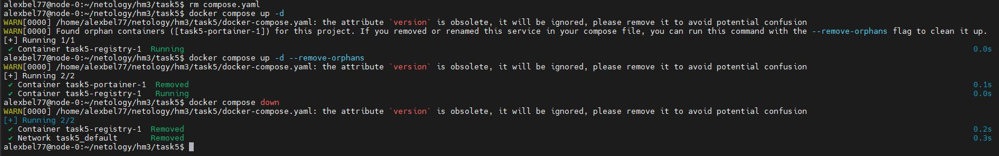

# Домашнее задание к занятию 4 «Оркестрация группой Docker контейнеров на примере Docker Compose»

# Задача 1

https://hub.docker.com/repository/docker/alexbel77/custom-nginx/general

# Задача 2

<center>

</center>

# Задача 3

<center>

</center>

<center>

</center>

<center>

</center>

3. `Ctrl + C` в attach посылает сигнал SIGINT для прерывания процесса внутри контейнера. Контейнер `custom-nginx-t2` остановился, потому что основной процесс был остановлен.

```ps1
2025/03/25 19:27:59 [notice] 1#1: signal 2 (SIGINT) received, exiting
```

10. Проблема связна с несоответсвием портов. При запуске контейнера мы пробросили порт 8080 на хосте на порт 80 внутри контейнера, но после изменения конфигурации `nginx`, внутри контейнера, `nginx` теперь слушает на порту 81, и теперь запросы не могут быть обработаны.

11. Исправили конфиги контейнера(`hostconfig.json` и `config.v2.json`)

```json
"PortBindings":{"81/tcp":[{"HostIp":"","HostPort":"8080"}]},
"ExposedPorts":{"80/tcp":{},"81/tcp":{}},
```

# Задача 4

<center>

</center>

# Задача 5

<center>

</center>

<center>

</center>

<center>

</center>

<center>

</center>

1. Путь по умолчанию для файла Compose — `compose.yaml` (предпочтительно) или `compose.yml`, который находится в рабочем каталоге. Compose также поддерживает `docker-compose.yaml` и `docker-compose.yml` для обратной совместимости с более ранними версиями. Если существуют оба файла, Compose предпочитает канонический `compose.yaml`.

7. Предупреждение говорит о том, что есть контейнеры, которые ранее были частью Compose-проекта, но сейчас не соответствуют никаким сервисам в `docker-compose.yaml`

8. [Файл compose.yaml](http)