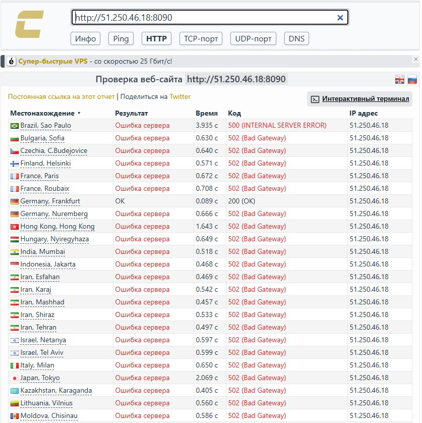
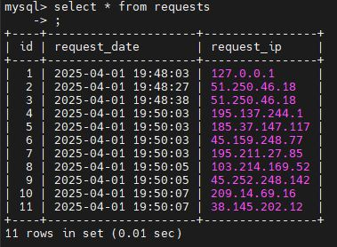

# Домашнее задание к занятию 5. «Практическое применение Docker»


# Задача 2*

<center>

</center>

# Задача 3

<center>

</center>

# Задача 4

<center>

</center>

<center>

</center>

[Bash-скрипт для скачивания и запуска проекта](https://github.com/alex-bel31/shvirtd-example-python/blob/main/install_run.sh)

[Ссылка на fork-репозиторий](https://github.com/alex-bel31/shvirtd-example-python)

# Задача 5*

<center>

</center>

[Скрипт для резервного копирования БД MySQL](https://github.com/alex-bel31/virtd-homeworks/blob/main/virt-04-docker-in-practice/dump_db.sh)

При запуске контейнера из образа `schnitzler/mysqldump`:

```ps1
docker run \
    --rm --entrypoint "" \
    -v /opt/backup:/backup \
    --network shvirtd-example-python_backend \
    schnitzler/mysqldump \
    mysqldump --opt -h shvirtd-example-python-db-1 -uroot -p******* --result-file=/backup/dumps.sql virtd
```

Выходила ошибка `Got error: 1045: "Plugin caching_sha2_password could not be loaded: Error loading shared library` скорее всего из-за использования старой версии `client-mysql` в образе. Поэтому использовал образ `mysql:8`.

# Задача 6

<center>

</center>

<center>

</center>

<center>

</center>

# Задача 6.1

<center>

</center>
